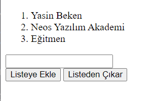
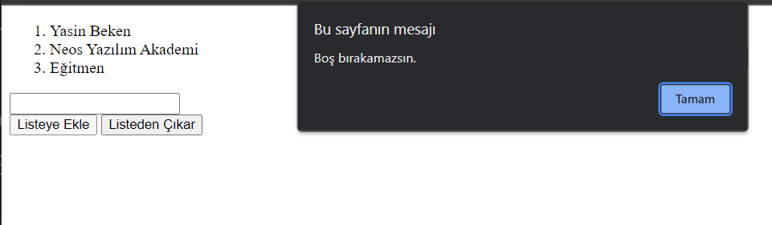
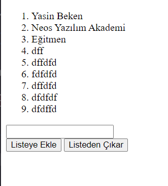
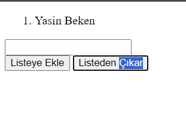

<h1><i>JQUERRY APPEND EXAMPLE</i></h1>

In this project, I wrote a code to allow the user to add items to the list by entering text and remove items from the list. If the input is empty, it prompts the user with an alert message to fill it.

